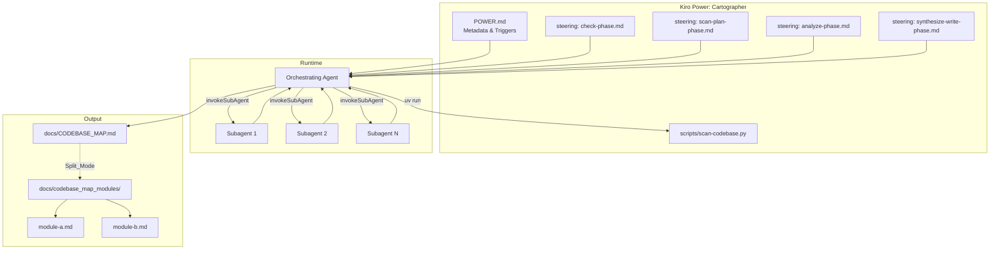
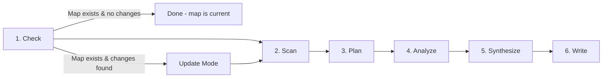
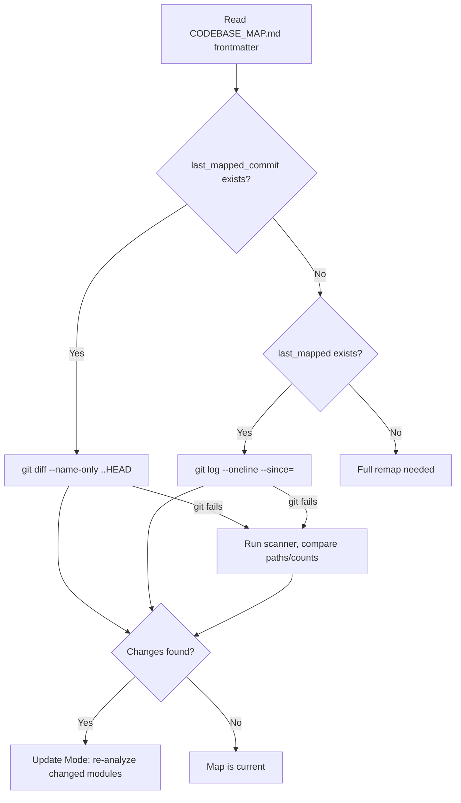

# Design Document: Claude-to-Kiro Power Conversion

## Overview

This design describes the conversion of the Cartographer Claude Code plugin into a Kiro Power. The Cartographer maps and documents codebases of any size by orchestrating parallel AI subagents. The converted Power preserves the core workflow (scan → plan → analyze → synthesize → write) while replacing all Claude-specific concepts with Kiro-native equivalents.

The key transformation areas are:

1. **Structure**: `.claude-plugin/plugin.json` + `SKILL.md` → `POWER.md` + steering files + `scripts/`
2. **Orchestration**: Claude `Task` tool with model selection → Kiro `invokeSubAgent` tool
3. **Output**: No more `CLAUDE.md`/`AGENTS.md` updates; output is `docs/CODEBASE_MAP.md` (with optional split into `docs/codebase_map_modules/`)
4. **Change tracking**: Git commit hash (`last_mapped_commit`) as primary change detection, timestamp as fallback, scanner diff as last resort
5. **Script reference**: `${CLAUDE_PLUGIN_ROOT}/...` → path relative to Power root directory

## Architecture

The Power follows a phased orchestration pattern where the main Kiro agent acts as the orchestrator and delegates file reading/analysis to subagents.



### Workflow Phases



**Phase details:**

| Phase      | Actor                | Action                                                                                                             |
| ---------- | -------------------- | ------------------------------------------------------------------------------------------------------------------ |
| Check      | Orchestrator         | Look for existing `docs/CODEBASE_MAP.md`, determine full vs update mode                                            |
| Scan       | Orchestrator         | Run `scan-codebase.py` via shell, capture JSON output                                                              |
| Plan       | Orchestrator         | Group files into subagent assignments, balance token budgets (~150k each), ask user about Split_Mode if >5 modules |
| Analyze    | Subagents (parallel) | Each subagent reads its assigned files and returns structured analysis                                             |
| Synthesize | Orchestrator         | Merge subagent reports, deduplicate, build architecture diagrams                                                   |
| Write      | Orchestrator         | Create/update `docs/CODEBASE_MAP.md` (and per-module files if Split_Mode)                                          |

## Components and Interfaces

### 1. POWER.md

The root descriptor file for the Kiro Power. Contains:

- **Frontmatter metadata**: name, description, author, version
- **Trigger phrases**: `"map this codebase"`, `"cartographer"`, `"create codebase map"`, `"document the architecture"`, `"understand this codebase"`
- **Workflow overview**: Brief description of the phased workflow with references to steering files
- **Script reference**: Points to `scripts/scan-codebase.py` relative to the Power root

**Key difference from SKILL.md**: POWER.md is a declarative descriptor. The detailed phase instructions live in steering files rather than being inlined.

### 2. Steering Files

Four steering files guide each workflow phase:

| File                        | Phase              | Responsibility                                                                               |
| --------------------------- | ------------------ | -------------------------------------------------------------------------------------------- |
| `check-phase.md`            | Check              | Detect existing map, determine full vs update mode, change detection logic                   |
| `scan-plan-phase.md`        | Scan + Plan        | Run scanner, parse output, group files into subagent assignments, prompt user for Split_Mode |
| `analyze-phase.md`          | Analyze            | Subagent prompt template, file analysis instructions, structured output format               |
| `synthesize-write-phase.md` | Synthesize + Write | Merge reports, build diagrams, write CODEBASE_MAP.md and optional per-module files           |

### 3. scripts/scan-codebase.py

The existing Python scanner script, preserved as-is. No code changes needed.

**Interface:**

```
Input:  uv run scripts/scan-codebase.py <path> --format json [--max-tokens N] [--encoding NAME]
Output: JSON to stdout with structure:
{
  "root": string,
  "files": [{ "path": string, "tokens": number, "size_bytes": number }],
  "directories": [string],
  "total_tokens": number,
  "total_files": number,
  "skipped": [{ "path": string, "reason": string, ... }]
}
```

**Invocation order of preference:**

1. `uv run scripts/scan-codebase.py . --format json` (preferred, auto-installs tiktoken)
2. `python3 scripts/scan-codebase.py . --format json`
3. `python scripts/scan-codebase.py . --format json`

All paths are relative to the Power root directory. No `CLAUDE_PLUGIN_ROOT` variable.

### 4. Subagent Interface

The orchestrating agent spawns subagents via `invokeSubAgent`. Each subagent receives:

**Input (via prompt):**

- List of file paths to read and analyze
- Instructions to document: purpose, exports, imports, patterns, gotchas per file
- Instructions to identify cross-file connections, entry points, data flow

**Output (returned to orchestrator):**

- Structured markdown with per-file analysis sections
- Module-level summary of connections and patterns

**Constraints:**

- Token budget per subagent: ~150,000 tokens
- All subagents for a phase are spawned in a single turn (parallel execution)
- No model name specified (Kiro handles model selection)
- Even small codebases (<100k tokens) use at least one subagent for file reading

### 5. Output Files

#### docs/CODEBASE_MAP.md (always generated)

**Frontmatter:**

```yaml
---
last_mapped_commit: <git HEAD hash>
last_mapped: <UTC ISO 8601 timestamp>
total_files: <number>
total_tokens: <number>
split_mode: <boolean>
---
```

**Sections:**

- System Overview (with Mermaid architecture diagram)
- Directory Structure (annotated tree)
- Module Guide (per-module: purpose, entry point, key files table, exports, dependencies, dependents)
- Data Flow (Mermaid sequence diagrams)
- Conventions
- Gotchas
- Navigation Guide

**Attribution line:** `> Auto-generated by Cartographer (Kiro Power). Last mapped: [date]`

#### docs/codebase_map_modules/\*.md (Split_Mode only)

One file per top-level module (e.g., `api.md`, `components.md`). Contains the detailed analysis that would otherwise be inline in CODEBASE_MAP.md. The index file links to these with relative paths.

### 6. Change Detection Interface

Used in the Check phase to determine if an update is needed:



## Data Models

### Power Directory Layout

```
cartographer-power/
├── POWER.md                          # Power descriptor with metadata and triggers
├── steering/
│   ├── check-phase.md                # Check for existing map, change detection
│   ├── scan-plan-phase.md            # Run scanner, plan subagent assignments
│   ├── analyze-phase.md              # Subagent analysis instructions
│   └── synthesize-write-phase.md     # Merge reports, write output
└── scripts/
    └── scan-codebase.py              # Preserved scanner script (unchanged)
```

### POWER.md Frontmatter Schema

```yaml
---
name: cartographer
description: "Maps and documents codebases of any size by orchestrating parallel subagents"
author: "Bootoshi"
version: "1.0.0"
triggers:
  - "map this codebase"
  - "cartographer"
  - "create codebase map"
  - "document the architecture"
  - "understand this codebase"
---
```

### Scanner JSON Output Schema

```typescript
interface ScanResult {
  root: string; // Absolute path of scanned directory
  files: FileEntry[];
  directories: string[]; // Relative directory paths
  total_tokens: number;
  total_files: number;
  skipped: SkippedEntry[];
}

interface FileEntry {
  path: string; // Relative file path
  tokens: number; // Token count via tiktoken
  size_bytes: number;
}

interface SkippedEntry {
  path: string;
  reason:
    | "too_large"
    | "binary"
    | "too_many_tokens"
    | "permission_denied"
    | string;
  size_bytes?: number;
  tokens?: number;
}
```

### CODEBASE_MAP.md Frontmatter Schema

```typescript
interface MapFrontmatter {
  last_mapped_commit: string; // Git HEAD hash at time of mapping
  last_mapped: string; // UTC ISO 8601 timestamp
  total_files: number;
  total_tokens: number;
  split_mode: boolean; // Whether per-module files exist
}
```

### Subagent Assignment Model

```typescript
interface SubagentAssignment {
  id: number; // Sequential subagent number
  files: string[]; // File paths to analyze
  directories: string[]; // Logical module groupings
  estimated_tokens: number; // Sum of file token counts
}
```

The orchestrator builds assignments by:

1. Grouping files by top-level directory (module)
2. If a single module exceeds 150k tokens, splitting it into sub-groups
3. Merging small modules together if they fit within the 150k budget

### Subagent Report Model

Each subagent returns a markdown report with this structure:

```markdown
## Module: <module_name>

### <file_path>

- **Purpose**: <one-line description>
- **Exports**: <key functions, classes, types>
- **Imports**: <notable dependencies>
- **Patterns**: <design patterns, conventions>
- **Gotchas**: <non-obvious behavior, edge cases>

### Module Connections

- Entry points: <list>
- Data flow: <description>
- Configuration dependencies: <list>
```

### Split_Mode Per-Module File Schema

When Split_Mode is active, each file under `docs/codebase_map_modules/` follows:

```markdown
# Module: <module_name>

> Part of [Codebase Map](../CODEBASE_MAP.md)

## Files

| File | Purpose | Tokens |
| ---- | ------- | ------ |
| ...  | ...     | ...    |

## Detailed Analysis

### <file_path>

- **Purpose**: ...
- **Exports**: ...
- **Imports**: ...
- **Patterns**: ...
- **Gotchas**: ...

## Module Connections

- **Dependencies**: <what this module imports>
- **Dependents**: <what imports this module>
- **Entry points**: <list>
```

## Correctness Properties

_A property is a characteristic or behavior that should hold true across all valid executions of a system — essentially, a formal statement about what the system should do. Properties serve as the bridge between human-readable specifications and machine-verifiable correctness guarantees._

### Property 1: No Claude-specific references in Power files

_For any_ text file in the Power directory (POWER.md, steering files), the content shall not contain any of the following Claude-specific references: `CLAUDE_PLUGIN_ROOT`, `plugin.json`, `marketplace.json`, `.claude-plugin`, `CLAUDE.md`, `AGENTS.md`, `Task tool`, `subagent_type`, Claude model names (`Sonnet`, `Opus`, `Haiku`), or the attribution string `Claude Code`. All subagent invocations shall reference `invokeSubAgent` and the attribution shall read `Cartographer (Kiro Power)`.

**Validates: Requirements 1.4, 2.5, 3.1, 3.2, 5.2, 5.3, 5.5**

### Property 2: Scanner format output validity

_For any_ valid directory tree, running the scanner with `--format json` shall produce valid JSON matching the ScanResult schema, running with `--format tree` shall produce a string containing the root directory name and token counts, and running with `--format compact` shall produce lines where each non-comment line matches the pattern `<number> <path>`.

**Validates: Requirements 2.2**

### Property 3: Scanner skip rules

_For any_ file in a scanned directory, if the file is binary, exceeds 1MB in size, or exceeds the configured max-token threshold, then it shall appear in the `skipped` array with the appropriate reason and shall not appear in the `files` array.

**Validates: Requirements 2.3**

### Property 4: Subagent token budget balancing

_For any_ set of files with token counts produced by the scanner, the planning phase shall produce subagent assignments where each assignment's total estimated tokens does not exceed 150,000 tokens, and every non-skipped file appears in exactly one assignment.

**Validates: Requirements 4.4**

### Property 5: Split_Mode threshold

_For any_ scan result, if the number of distinct top-level directories (modules) exceeds 5, the workflow shall prompt the user for Split_Mode selection. If the number is 5 or fewer, Split_Mode shall not be offered and shall default to false.

**Validates: Requirements 4.5**

### Property 6: CODEBASE_MAP.md completeness

_For any_ generated CODEBASE_MAP.md, the file shall contain valid YAML frontmatter with all required fields (`last_mapped_commit`, `last_mapped`, `total_files`, `total_tokens`, `split_mode`), and shall contain all required sections: System Overview, Directory Structure, Module Guide, Data Flow, Conventions, Gotchas, and Navigation Guide.

**Validates: Requirements 4.8, 5.4, 7.5**

### Property 7: Split_Mode output correctness

_For any_ generated codebase map output, if `split_mode` is true in the frontmatter, then CODEBASE_MAP.md shall contain only module summaries with relative links to files under `docs/codebase_map_modules/`, and each linked per-module file shall exist and contain the detailed analysis (file purposes, exports, imports, patterns, gotchas). If `split_mode` is false, then CODEBASE_MAP.md shall contain the full detailed analysis inline and no `docs/codebase_map_modules/` directory shall be referenced.

**Validates: Requirements 4.9, 4.10**

### Property 8: Update mode targets only changed modules

_For any_ existing CODEBASE_MAP.md and a set of changed files identified by change detection, the update workflow shall spawn subagents only for modules that contain at least one changed file, and shall leave all other module sections unchanged in the output.

**Validates: Requirements 7.4**

### Property 9: Split_Mode update refreshes affected summaries

_For any_ update performed in Split_Mode, if a per-module file under `docs/codebase_map_modules/` is regenerated, then the corresponding module summary in CODEBASE_MAP.md shall also be refreshed to reflect the updated analysis.

**Validates: Requirements 7.6**

## Error Handling

### Scanner Errors

| Error                          | Detection                                              | Response                                                                                |
| ------------------------------ | ------------------------------------------------------ | --------------------------------------------------------------------------------------- |
| tiktoken not installed         | Scanner exits with error message containing "tiktoken" | Steering file instructs: suggest `pip install tiktoken` or `uv run` which auto-installs |
| Python not found               | Shell command fails with "command not found"           | Steering file instructs: try `python3`, `python`, or `uv run` in order                  |
| Permission denied on directory | Scanner reports `permission_denied` in skipped array   | Log warning, continue with accessible files                                             |
| Path does not exist            | Scanner exits with "Path does not exist" error         | Report to user, ask for correct path                                                    |

### Subagent Errors

| Error                             | Detection                                    | Response                                                                       |
| --------------------------------- | -------------------------------------------- | ------------------------------------------------------------------------------ |
| Subagent fails to return analysis | invokeSubAgent returns error or empty result | Report which file group failed, suggest re-running the mapping for that module |
| Subagent exceeds token budget     | Files assigned exceed context window         | Steering file instructs: split the assignment into smaller groups and re-spawn |
| All subagents fail                | No successful reports returned               | Abort synthesis, report failure, suggest checking file accessibility           |

### Change Detection Errors

| Error                            | Detection                                | Response                                                                                   |
| -------------------------------- | ---------------------------------------- | ------------------------------------------------------------------------------------------ |
| Git not available                | `git` command fails                      | Fall back to scanner diff (compare file paths and counts against existing map frontmatter) |
| Commit hash no longer in history | `git diff` fails with "unknown revision" | Fall back to timestamp-based detection, then scanner diff                                  |
| No frontmatter in existing map   | Parsing fails to find YAML frontmatter   | Treat as full remap needed                                                                 |

### Output Errors

| Error                                                   | Detection                  | Response                                                                                       |
| ------------------------------------------------------- | -------------------------- | ---------------------------------------------------------------------------------------------- |
| `docs/` directory doesn't exist                         | Write fails                | Create `docs/` directory before writing                                                        |
| `docs/codebase_map_modules/` doesn't exist (Split_Mode) | Write fails                | Create directory before writing per-module files                                               |
| Git HEAD hash unavailable                               | `git rev-parse HEAD` fails | Write `last_mapped_commit: null` in frontmatter, rely on timestamp for future change detection |

## Testing Strategy

### Property-Based Testing

Property-based tests use **fast-check** (JavaScript/TypeScript) or **Hypothesis** (Python) depending on the test target. Each property test runs a minimum of 100 iterations.

Each property-based test must be tagged with a comment referencing the design property:

```
// Feature: claude-to-kiro-power, Property N: <property_text>
```

| Property                           | Test Approach                                                                                                            | Library                                         |
| ---------------------------------- | ------------------------------------------------------------------------------------------------------------------------ | ----------------------------------------------- |
| P1: No Claude references           | Generate random Power file content, inject forbidden strings, verify detection                                           | fast-check or Hypothesis                        |
| P2: Scanner format validity        | Generate random directory trees, run scanner with each format, validate output schema                                    | Hypothesis (Python, tests the scanner directly) |
| P3: Scanner skip rules             | Generate files with varying sizes/types/token counts, verify correct skip/include classification                         | Hypothesis                                      |
| P4: Token budget balancing         | Generate random file lists with token counts, run planning algorithm, verify all assignments ≤150k and all files covered | fast-check or Hypothesis                        |
| P5: Split_Mode threshold           | Generate scan results with varying module counts (1-20), verify threshold behavior at boundary of 5                      | fast-check or Hypothesis                        |
| P6: Map completeness               | Generate random synthesis outputs, run write phase, verify frontmatter fields and section headers present                | fast-check or Hypothesis                        |
| P7: Split_Mode output correctness  | Generate module data with split_mode true/false, verify output structure matches mode                                    | fast-check or Hypothesis                        |
| P8: Update targets changed modules | Generate existing map + changed file list, verify only affected modules are re-analyzed                                  | fast-check or Hypothesis                        |
| P9: Split_Mode update summaries    | Generate split-mode update scenario, verify index summaries refreshed for regenerated modules                            | fast-check or Hypothesis                        |

### Unit Testing

Unit tests cover specific examples, edge cases, and integration points. They complement property tests by verifying concrete scenarios.

| Area                  | Test Cases                                                                            |
| --------------------- | ------------------------------------------------------------------------------------- |
| POWER.md structure    | Verify all required trigger phrases present; verify frontmatter fields                |
| Steering file content | Verify each phase file exists and contains key instructions                           |
| Scanner invocation    | Verify correct command construction without CLAUDE_PLUGIN_ROOT                        |
| Change detection flow | Test: commit hash present → git diff; timestamp only → git log; no git → scanner diff |
| Split_Mode decision   | Test: exactly 5 modules → no prompt; 6 modules → prompt                               |
| Frontmatter parsing   | Test: valid frontmatter extraction; missing fields; malformed YAML                    |
| Error scenarios       | Test: tiktoken missing message; Python not found fallback; subagent failure reporting |

### Test Organization

```
tests/
├── property/
│   ├── test_no_claude_refs.py       # Property 1
│   ├── test_scanner_formats.py      # Property 2
│   ├── test_scanner_skips.py        # Property 3
│   ├── test_token_balancing.py      # Property 4
│   ├── test_split_threshold.py      # Property 5
│   ├── test_map_completeness.py     # Property 6
│   ├── test_split_output.py         # Property 7
│   ├── test_update_targeting.py     # Property 8
│   └── test_split_update.py         # Property 9
└── unit/
    ├── test_power_structure.py
    ├── test_steering_content.py
    ├── test_change_detection.py
    ├── test_frontmatter.py
    └── test_error_handling.py
```
