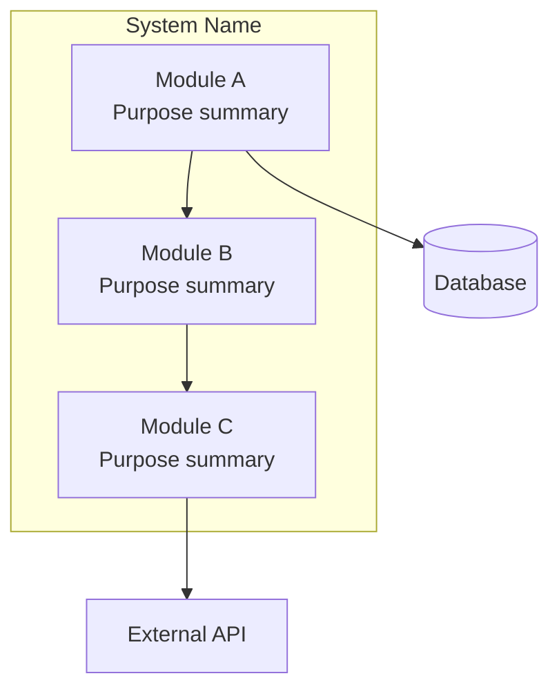
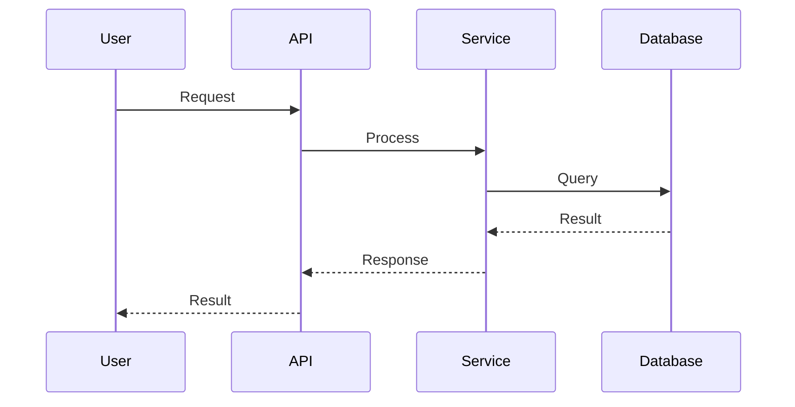

# Synthesize & Write Phase

Merge subagent reports into a unified codebase map, build architecture diagrams, and write the final output files.

## Step 1: Merge Subagent Reports

Read all subagent reports from disk at `docs/.cartographer/reports/`. Each report file contains one or more `## Module: <name>` sections with per-file analysis and module connections.

```bash
ls docs/.cartographer/reports/
```

Read each `<id>.md` file. If any expected report files are missing (due to subagent failures in the Analyze phase), note the gaps — those modules will have incomplete coverage.

### 1a. Combine Module Sections

- Group all module sections by module name. If multiple subagents analyzed parts of the same module (because it was split during planning), merge their file analyses into a single module section.
- Preserve every file's analysis fields: Purpose, Exports, Imports, Patterns, Gotchas.
- Merge the Module Connections blocks: combine entry point lists, unify data flow descriptions, and merge configuration dependency lists.

### 1b. Deduplicate

- If the same file appears in multiple subagent reports (should not happen, but handle gracefully), keep the more detailed analysis.
- If multiple modules report the same cross-module dependency, mention it once in the Data Flow section rather than repeating it per module.

### 1c. Identify Cross-Cutting Concerns

Scan across all module reports for patterns that span multiple modules:

- **Shared conventions**: Naming patterns, error handling strategies, logging approaches, or coding styles that appear consistently across modules.
- **Common dependencies**: External packages or internal utilities imported by many modules.
- **Architectural patterns**: Layered architecture, event-driven patterns, middleware chains, or plugin systems that connect multiple modules.
- **Shared configuration**: Environment variables or config files referenced by multiple modules.

Record these cross-cutting concerns — they feed into the Conventions, Gotchas, and System Overview sections of the final output.

## Step 2: Build Diagrams

### 2a. Architecture Diagram

Build a Mermaid diagram showing the high-level system architecture. Include:

- Each top-level module as a node.
- Dependency arrows between modules (based on the Imports and Module Connections data from subagent reports).
- External systems or services that modules interact with (databases, APIs, file systems).

Example structure:



Use the actual module names and their relationships from the merged reports. Keep the diagram readable — if there are many modules, group related ones into subgraphs.

### 2b. Data Flow Diagrams

Build one or more Mermaid sequence diagrams showing how data flows through the system for key operations. Use the Data Flow and Module Connections information from the subagent reports.

Example structure:



Focus on the most important data flows. If the codebase has many distinct flows, include the 3–5 most significant ones.

## Step 3: Get Frontmatter Values

Before writing the output files, gather the values needed for the CODEBASE_MAP.md frontmatter.

### 3a. Git Commit Hash

Run:

```bash
git rev-parse HEAD
```

- If the command succeeds, use the output as `last_mapped_commit`.
- If the command fails (git not available, not a git repo), set `last_mapped_commit: null`.

### 3b. Current Timestamp

Run a shell command to get the current UTC time in ISO 8601 format:

```bash
date -u +"%Y-%m-%dT%H:%M:%SZ"
```

Use the output as `last_mapped`.

### 3c. Scanner Values

From the scanner output captured during the Scan phase:

- `total_files`: the `total_files` value from the scanner JSON.
- `total_tokens`: the `total_tokens` value from the scanner JSON.

### 3d. Split_Mode

Use the Split_Mode decision recorded during the Plan phase (`true` or `false`).

## Step 4: Write Output — Non-Split_Mode

If Split_Mode is **off** (`split_mode: false`), write all content into a single `docs/CODEBASE_MAP.md` file.

Create the `docs/` directory if it does not exist.

### File Structure

```markdown
---
last_mapped_commit: <git HEAD hash or null>
last_mapped: <UTC ISO 8601 timestamp>
total_files: <number>
total_tokens: <number>
split_mode: false
---

> Auto-generated by Cartographer (Kiro Power). Last mapped: <last_mapped value>

# Codebase Map

## System Overview

<High-level description of what this codebase does, its purpose, and its main components.>

<Mermaid architecture diagram from Step 2a>

## Directory Structure

<Annotated directory tree showing top-level directories and their purposes. Example:>
```

project/
├── src/ # Main application source
│ ├── api/ # REST API routes and handlers
│ ├── services/ # Business logic layer
│ └── utils/ # Shared utility functions
├── lib/ # Shared libraries
├── tests/ # Test suites
└── docs/ # Documentation

```

## Module Guide

<For each module, include a full detailed section:>

### <Module Name>

**Purpose**: <One-paragraph description of what this module does>

**Entry Point**: <Main entry file(s)>

#### Key Files

| File | Purpose | Tokens |
|------|---------|--------|
| <file_path> | <purpose> | <token_count> |

#### Exports

<Key functions, classes, types, and constants exported by this module>

#### Dependencies

<What this module imports — both internal modules and external packages>

#### Dependents

<What other modules import from this module>

<Repeat for each module>

## Data Flow

<Description of how data moves through the system>

<Mermaid sequence diagrams from Step 2b>

## Conventions

<Coding conventions, naming patterns, architectural patterns, and shared practices identified across the codebase. Draw from the cross-cutting concerns identified in Step 1c.>

## Gotchas

<Non-obvious behaviors, implicit assumptions, edge cases, and things a developer new to this codebase should watch out for. Aggregate from per-file gotchas and cross-cutting concerns.>

## Navigation Guide

<Practical guide for developers: where to start reading, how to trace a request through the system, where to add new features, and how the modules connect.>
```

The only output files are `docs/CODEBASE_MAP.md` and (when in Split_Mode) files under `docs/codebase_map_modules/`. Do **not** generate or update any other documentation files outside the `docs/` directory.

## Step 5: Write Output — Split_Mode

If Split_Mode is **on** (`split_mode: true`), write a summary index in `docs/CODEBASE_MAP.md` and detailed per-module files under `docs/codebase_map_modules/`.

Create the `docs/` and `docs/codebase_map_modules/` directories if they do not exist.

### 5a. Index File (docs/CODEBASE_MAP.md)

The index file contains module summaries with links to per-module files. It does **not** contain detailed per-file analysis.

```markdown
---
last_mapped_commit: <git HEAD hash or null>
last_mapped: <UTC ISO 8601 timestamp>
total_files: <number>
total_tokens: <number>
split_mode: true
---

> Auto-generated by Cartographer (Kiro Power). Last mapped: <last_mapped value>

# Codebase Map

## System Overview

<High-level description of what this codebase does, its purpose, and its main components.>

<Mermaid architecture diagram from Step 2a>

## Directory Structure

<Annotated directory tree>

## Module Guide

| Module        | Purpose            | Files        | Tokens        | Details                                               |
| ------------- | ------------------ | ------------ | ------------- | ----------------------------------------------------- |
| <module_name> | <one-line purpose> | <file_count> | <token_total> | [View details](codebase_map_modules/<module_name>.md) |

<Repeat for each module>

## Data Flow

<Description of how data moves through the system>

<Mermaid sequence diagrams from Step 2b>

## Conventions

<Coding conventions and shared practices>

## Gotchas

<Non-obvious behaviors and edge cases>

## Navigation Guide

<Practical guide for developers>
```

### 5b. Per-Module Files (docs/codebase_map_modules/<module_name>.md)

Create one file per top-level module. Use the module name as the filename (e.g., `api.md`, `components.md`). Sanitize module names for use as filenames — replace special characters with hyphens, use lowercase.

Each per-module file follows this format:

```markdown
# Module: <module_name>

> Part of [Codebase Map](../CODEBASE_MAP.md)

## Files

| File        | Purpose   | Tokens        |
| ----------- | --------- | ------------- |
| <file_path> | <purpose> | <token_count> |

## Detailed Analysis

### <file_path>

- **Purpose**: <one-line description>
- **Exports**: <key functions, classes, types>
- **Imports**: <notable dependencies>
- **Patterns**: <design patterns, conventions>
- **Gotchas**: <non-obvious behavior, edge cases>

<Repeat for each file in the module>

## Module Connections

- **Dependencies**: <what this module imports from other modules and external packages>
- **Dependents**: <what other modules import from this module>
- **Entry points**: <list of entry point files>
```

The only output files are `docs/CODEBASE_MAP.md` and (when in Split_Mode) files under `docs/codebase_map_modules/`. Do **not** generate or update any other documentation files outside the `docs/` directory.

## Step 6: Update Mode

If the workflow is running in **Update Mode** (set during the Check phase), follow these rules instead of writing the entire map from scratch.

### 6a. Identify Affected Modules

From the changed files identified during the Check phase, determine which modules were re-analyzed by subagents in the Analyze phase. Only these modules have new subagent reports.

### 6b. Update Non-Split_Mode

If `split_mode` is `false`:

1. Read the existing `docs/CODEBASE_MAP.md`.
2. For each re-analyzed module, replace its section under **Module Guide** with the new content from the merged subagent reports.
3. Leave all other module sections **unchanged**.
4. Refresh the **System Overview** diagram if module relationships changed.
5. Refresh the **Data Flow** section if data flow patterns changed for the affected modules.
6. Update the **Conventions** and **Gotchas** sections only if the re-analyzed modules revealed new cross-cutting concerns.
7. Update the frontmatter: set `last_mapped_commit` and `last_mapped` to the current values (from Step 3). Update `total_files` and `total_tokens` from the latest scanner output.

### 6c. Update Split_Mode

If `split_mode` is `true`:

1. For each re-analyzed module, **regenerate** its per-module file under `docs/codebase_map_modules/`. Overwrite the existing file with the new content.
2. In `docs/CODEBASE_MAP.md`, **refresh the summary row** in the Module Guide table for each regenerated module — update the purpose, file count, and token total.
3. Leave all other per-module files and summary rows **unchanged**.
4. Refresh the **System Overview** diagram if module relationships changed.
5. Refresh the **Data Flow** section if data flow patterns changed for the affected modules.
6. Update the **Conventions** and **Gotchas** sections only if the re-analyzed modules revealed new cross-cutting concerns.
7. Update the frontmatter: set `last_mapped_commit` and `last_mapped` to the current values. Update `total_files` and `total_tokens` from the latest scanner output.

### 6d. Scan for Stale References

After updating module sections, scan the entire output for stale symbol references using the renamed/removed symbols list from the Check phase:

1. For each **renamed symbol** (old name → new name):
   - Search `docs/CODEBASE_MAP.md` for the old name.
   - Search all files in `docs/.cartographer/reports/` for the old name.
   - If in Split_Mode, search all files in `docs/codebase_map_modules/` for the old name.
   - Replace occurrences of the old name with the new name.

2. For each **removed symbol** (no replacement):
   - Search the same files for the removed name.
   - If found, flag it with a note: `⚠️ <symbol_name> was removed in the latest update` or remove the reference if it's in a list of exports/imports.

3. Pay special attention to these sections which reference symbols across module boundaries:
   - **Gotchas** — often references specific function names.
   - **Data Flow** — references function calls and data transformations.
   - **Conventions** — may reference naming patterns tied to specific symbols.
   - **Navigation Guide** — may reference specific entry points by name.

### 6e. Preserve Unchanged Content

When updating, take care to:

- **Not rewrite** module sections that were not re-analyzed. Copy them through as-is.
- **Not delete** per-module files for modules that were not re-analyzed.
- **Not alter** the Navigation Guide unless the re-analyzed modules significantly change the codebase structure.

## Step 7: Post-Update Validation

After writing all output files in Update Mode, run a validation pass to catch any remaining stale references:

1. Get the list of removed symbols (symbols that appeared on `-` diff lines but not on `+` lines) from the Check phase.

2. For each removed symbol, grep the generated docs:

   ```bash
   grep -rn "<removed_symbol>" docs/CODEBASE_MAP.md docs/.cartographer/reports/ docs/codebase_map_modules/ 2>/dev/null
   ```

3. If any matches are found, these are stale references that slipped through. Fix them:
   - If the symbol was renamed, replace with the new name.
   - If the symbol was deleted with no replacement, remove the reference or add a note that it no longer exists.
   - If the reference is in a report for a module that wasn't re-analyzed, update that report file directly.

4. Report any stale references found and fixed to the user so they're aware of the ripple effects.

This step is only needed in Update Mode. Full mapping mode generates everything fresh, so stale references aren't possible.

## Error Handling

- **`docs/` directory does not exist**: Create it before writing any files.
- **`docs/codebase_map_modules/` directory does not exist** (Split_Mode): Create it before writing per-module files.
- **`git rev-parse HEAD` fails**: Set `last_mapped_commit: null` in the frontmatter. The next update cycle will rely on the `last_mapped` timestamp for change detection.
- **Incomplete subagent reports**: If some modules have gaps in their analysis (flagged during the Analyze phase), include what is available and add a note in the affected module section indicating incomplete coverage.

## Output

At the end of this phase, the following files should exist:

**Non-Split_Mode:**

- `docs/CODEBASE_MAP.md` — complete codebase map with all sections and detailed per-module analysis inline.

**Split_Mode:**

- `docs/CODEBASE_MAP.md` — index file with module summaries and links to per-module files.
- `docs/codebase_map_modules/<module_name>.md` — one file per module with detailed analysis.

The codebase mapping workflow is now complete.
